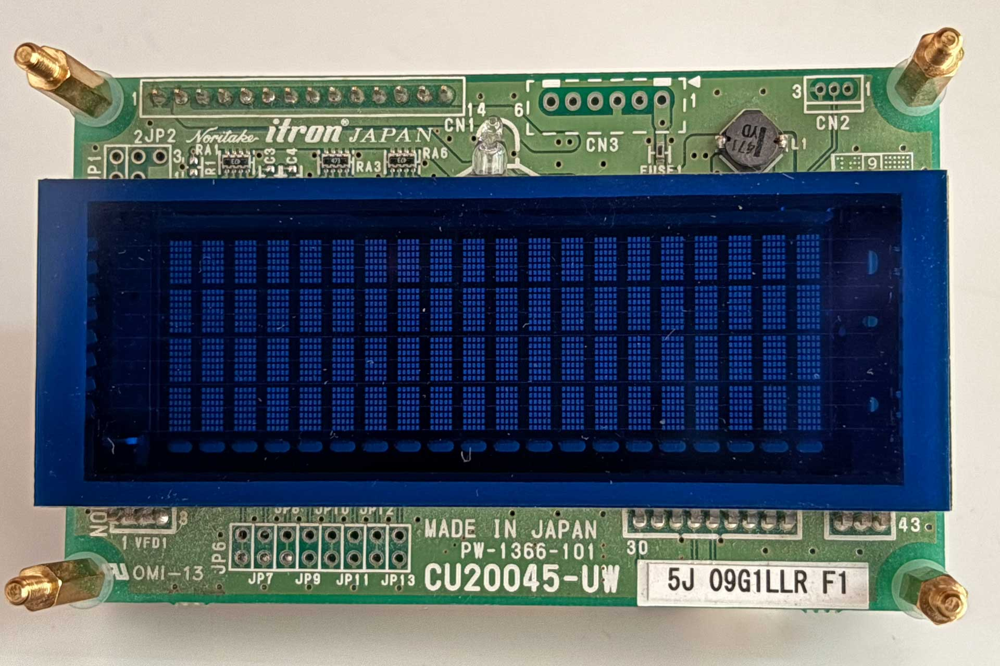
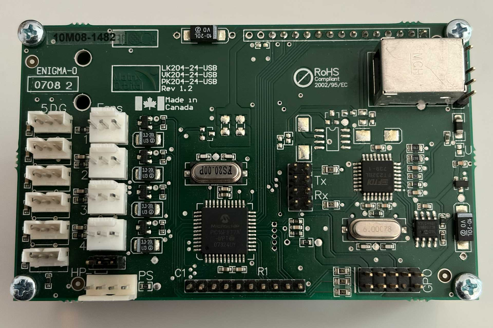
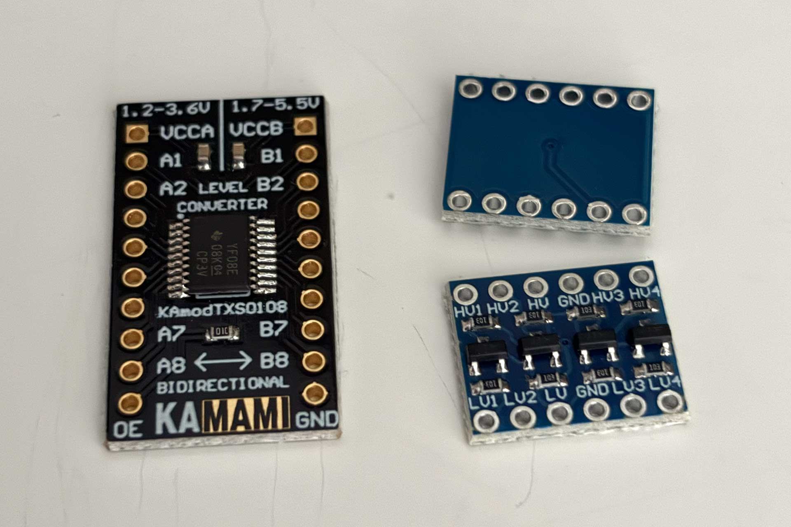
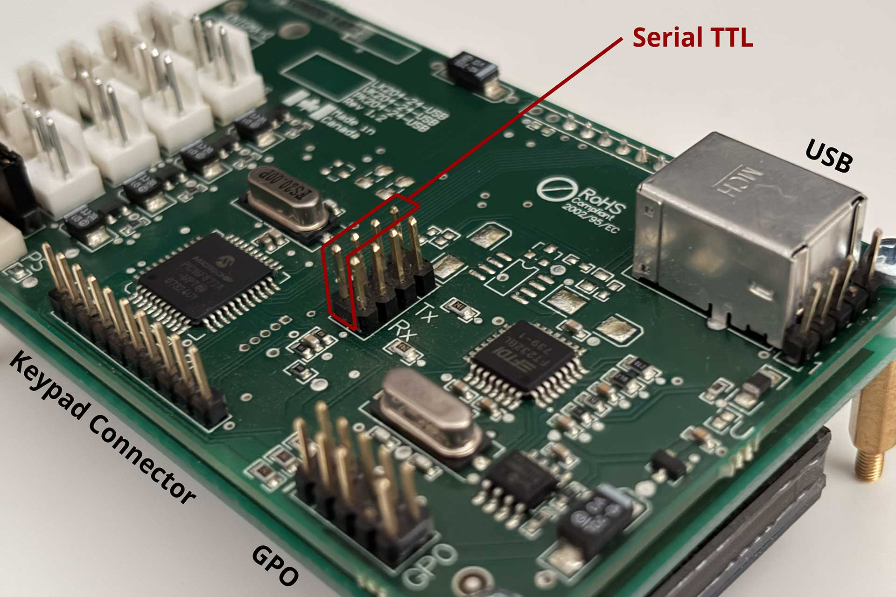
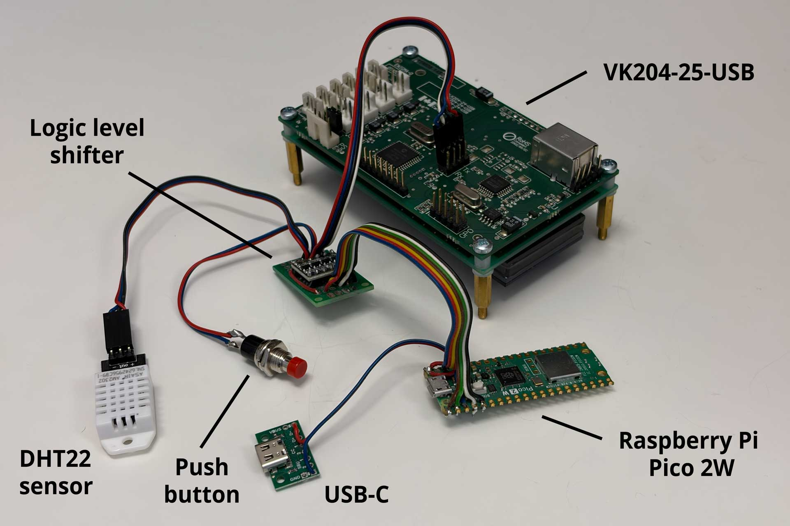
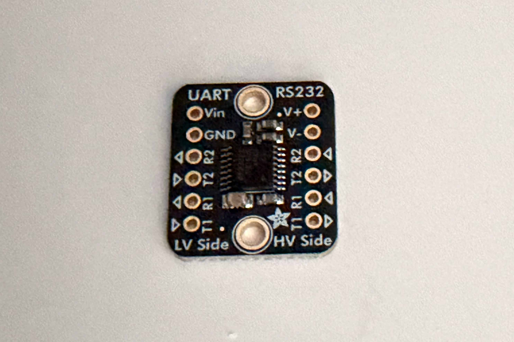
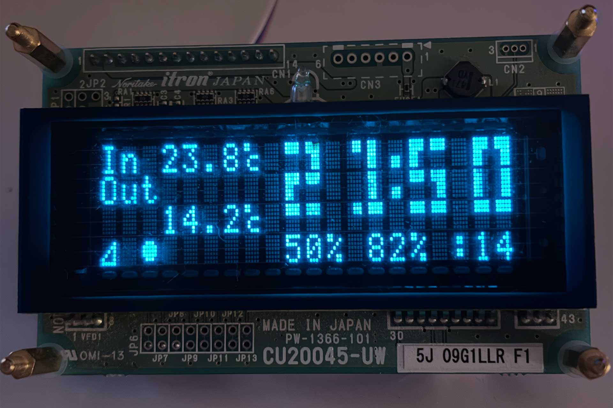
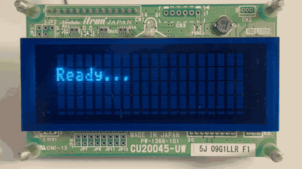

# Matrix Orbital LK and VK series displays MicroPython driver library

A MicroPython library for controlling Matrix Orbital LK and VK series
intelligent character display modules.

## What are these Matrix Orbital modules?

Matrix Orbital Intelligent Modules are advanced, self-contained display
solutions, available in LCD and VFD technologies.

Unlike raw display components that require low-level parallel wiring, Matrix
Orbital modules abstract the hardware layer entirely. They can communicate
over the standard serial interface, allowing the host controller to display
text or graphs, using high-level commands. Newer modules also have GPO power
pins that allow controlling fans or other devices.

Because I had some Matrix Orbital modules handy, I decided to write
a driver for them so that I can use them in my projects.

## Supported models

This library supports display-related and GPO-related Matrix Orbital
commands only. Some modules also have keypad connectors and other features –
support for these is not included in this library.

The following LK and VK models are supported:

- LK162 and VK162 – 16x2 characters
- LK202 and VK202 – 20x2 characters
- LK204 and VK204 – 20x4 characters
- LK402 and VK402 – 40x2 characters
- LK404 and VK404 – 40x4 characters.

LK series are modules with an LCD, while VK series are modules with a VFD.

Note: Models usually include factory suffixes (e.g., -12 or -25-USB)
indicating interface or revision details. All variations of the base models
listed above are fully supported (for example, VK204-25-USB,
or LK162-12).

Because Matrix Orbital uses the same display command set in their products, 
these other modules should also work:
- LCD0821 – 8x2 characters
- LCD1641 – 16x4 characters
- LCD2021 – 20x2 characters
- LCD2041 – 20x4 characters
- LCD4021 – 40x2 characters
- LCD4041 – 40x4 characters
- VFD2021 – 20x2 characters
- VFD2041 – 20x4 characters
- VFD4021 – 40x2 characters

Here is an example supported display (VK204-25-USB Rev 1.2):

We can see that in this module they have used the Noritake CU20045-UW5J VFD.

And here is a photo featuring the back of the module:

## What is included in this library?

The Matrix Orbital library includes:
- An API to control Matrix Orbital modules
- A weather and clock project that uses this API
- Readme file with detailed information

The Matrix Orbital library was implemented for MicroPython. However,
with a bit of work it is possible to adapt it for regular Python.

## Connections

Depending on the model, Matrix Orbital modules often provide various
connection options. This library is designed to work with serial connection
at TTL levels.

### Serial TTL

Serial TT uses 0 V to 5 V levels, where 5 V is logic 1 while 0 V
is logic 0.

When using this connection type, if your board is Raspberry Pi Pico, or any
other board that uses less than 5 V on its GPIO, you need to use a logic
level shifter.

Example logic level shifting development boards are shown below:

To connect a Matrix Orbital module to a MicroPython board (e.g., Raspberry
Pi Pico, ESP32, etc.) you need to identify the serial TTL pins.

In the example VK204-25-USB (Revision 1.2) module, the TTL port is oriented
from top to bottom. There are two columns of pins where the left column
is the serial TTL port with the following pins:

- pin 1 - VCC - 5 V
- pin 2 - RXD - Receive Data
- pin 3 - TXD - Transmit Data
- pin 4 - GND - Ground

The following picture shows the TTL port on the VK204-25-USB module:

The next picture shows a serial TTL connection between the TTL port and
the MicroPython board. I have used a Raspberry Pi Pico 2 W as my
microcontroller.

On one end of the cable I have crimped a connector which attaches to the TTL
port. The other end of the cable I have soldered to the GPIO pins 0 and 1 on the
Raspberry PI Pico with logic level shifter between the module and the
microcontroller.

There are other elements shown on the photo: a DHT22, a button, a USB-C port.
They are used in the weather and clock project explained later below.

### Serial RS232

Serial RS232 uses up to -25 V to 25 V levels, where generally negative voltage
is logic 1, while positive voltage is logic 0.

This connection type should also work. However, most boards like the Raspberry
Pi 5, Raspberry Pi Pico or ESP32 do not support it out of the box. The use
of it is not recommended but is possible through an UART to RS232 converter, like the MAX3232 chip:

## Weather and clock display

The weather and clock project is a simple script that displays the current
weather conditions, time and indoor temperature and humidity on a
Matrix Orbital module.

It is being launched by default in the main.py file.

For it to work, there are a few steps:
- You need to connect the Matrix Orbital module to your microcontroller, as
  explained above.
- You need to connect DHT22 sensor to the microcontroller pin that you specify
  in the main.py file.
- You need to connect a button to the microcontroller pin that you specify
  in the main.py file.
- You need to create a config file based on the instructions below.

### Config file

To prepare the config file copy `weather_clock_config.py` to
`weather_clock_config_local.py` and do these edits in the copy:

- `wifi_ssid` - provide the name of your Wi-Fi network
- `wifi_password` - provide the password to your Wi-Fi network
- `time_api_key` - the system needs to access the timeapi.world API to get the timezone-dependent time
- `time_timezone` - provide the timezone for which to get the time
- `weather_api_key` - the system needs to access the OpenWeatherMap API to get the weather data
- `weather_city` - provide the city for which to show the weather
- `weather_unit` - set either to 'metric' or 'imperial'
- `display_dim_start_hour` - at what hour the display should dim because it is early night
- `display_dim_end_hour` - at what hour the display should finish dimming
- `display_off_start_hour` - at what hour the display should turn off because it is late night
- `display_off_end_hour` - at what hour the display should turn on again

When you edit the configuration, you need to get API keys for timeapi.world and
for OpenWeatherMap. Links are provided in the configuration file. The API
keys are needed so that the weather and clock project can retrieve the proper
time and weather from the internet.

### The result

Once you solder everything and configure everything in the config file,
then you can run the main.py file. If the Wi-Fi and APIs access worked,
then you should see the module showing all the weather and time data on the
display.

The following picture shows the Weather and Clock project in action:

The icon on the very bottom left is Wi-Fi status. The circle next to it
indicates that it is cloudy weather. Empty circle would mean sunny, and there
are also icons for rain and snow.

The third icon, the arrow, prints for a minute after each data fetching
from the Internet.

